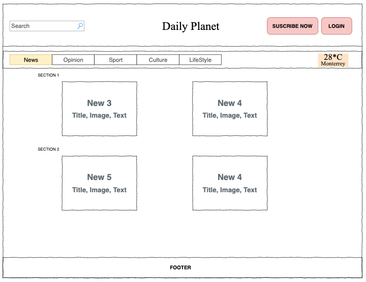
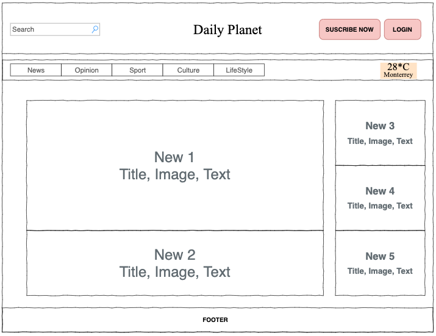
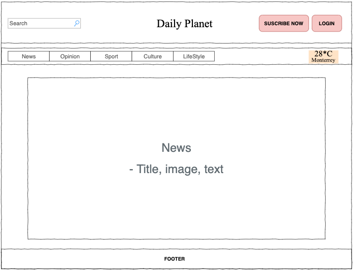
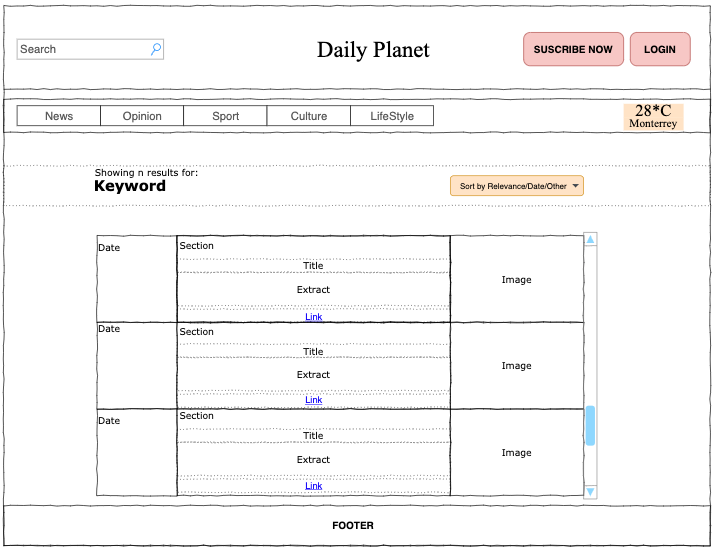
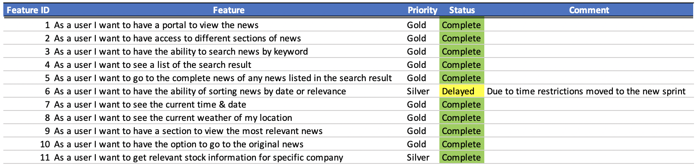
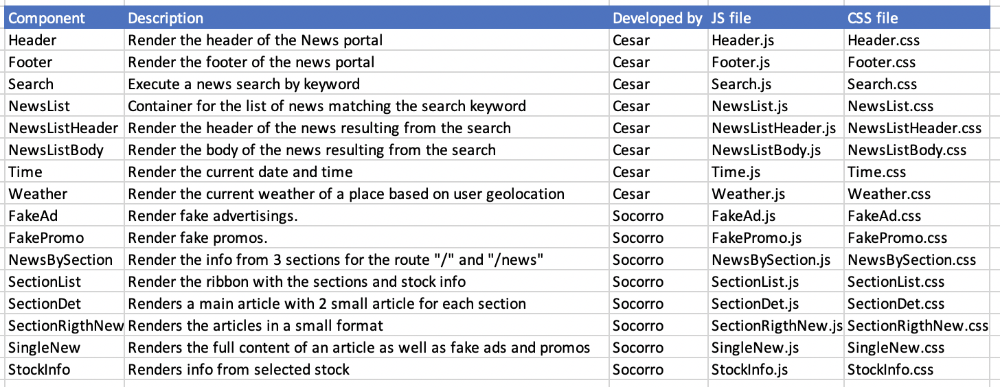
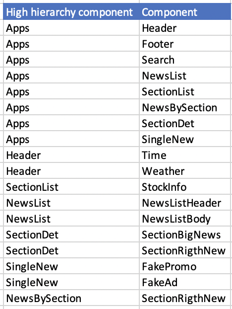
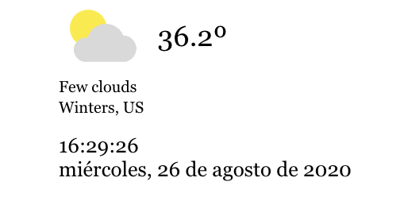
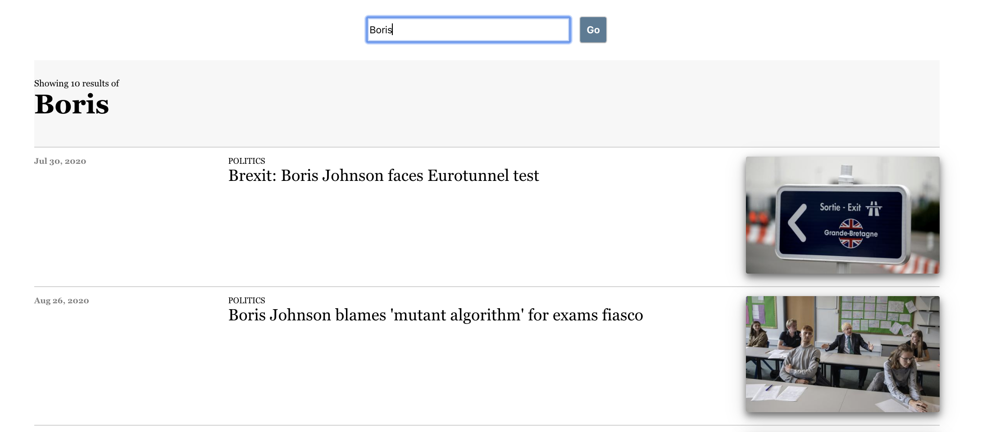

# Project 3 - The Propeth 
Developers: César Treviño y Socorro Pinto

***

#The application

The Propeth is a Portal News App. 
There you can read news for the following sections:

+ World
+ Culture
+ Business
+ Politics
+ Science
+ Sport
+ Technology
+ Search news by tags.

The news information is taken from The Guardian API: [The Guardian](https://open-platform.theguardian.com/documentation/).
The weather information is taken from the Weatherbit.io API: [Weatherbit](https://www.weatherbit.io/).
The stock information is taken from Alpha Vantage API: [AlphaVantage](https://www.alphavantage.co/).
 
***

# Technical Details

Used tools for this application:
+ REACT
+ HTML5
+ CSS

The following command could be used to start the application:
`npm start`
this will open [The Propeth](http://localhost:300/) to view in the browser.

***

# Planning

We created the following wireframes and based on them to plan ahead:

For the first page of the portal:

The page for a particular section:

The page for a particular article:

The page for searching news based on user inputs:

## Also we had the following user stories:

For this application we created the following components:

And they have the following hierarchy:

# Main Components Explained

The app is handled mainly by the routes defined in App.js

List of main components and short explanation:
+ ### Header
    + Contains our Portal Title
        

    + Weather Info and Time:
        1. Time
        2. Weather
        

        These components have a timer that keeps the info updated.
        The Weather component will obtain your GeoLocation and based on that will show the weather.

+ ### SectionList
    + And the list of sections ribbon:
        1. SectionList
        2. StockInfo
        

        The stock info will display by default John Deere Stocks.
        Also allows you to search by company and display their stock info.

+ ### Search
    + Contains a form that allows you to input your search and see the results:
        1. NewsList
        

+ ### NewsBySection
    + Contains links to 3 articles for 3 sections
        1. SectionRightNews
        

+ ### SectionDet
    + Contains one main article and two small ones
        1. SectionBigNews
        2. SectionRightNews
        

+ ### SingleNew
    + Contains the whole articule and some fake promos and ads
        1. FakeAd
        2. FakePromo
        

        The promos have a timer that changes them every few secons.
        The ads are gifs that change also every few seconds.

This is the documentation for this project, if you have any questions or comments, please, don't hesitate to contact me.
